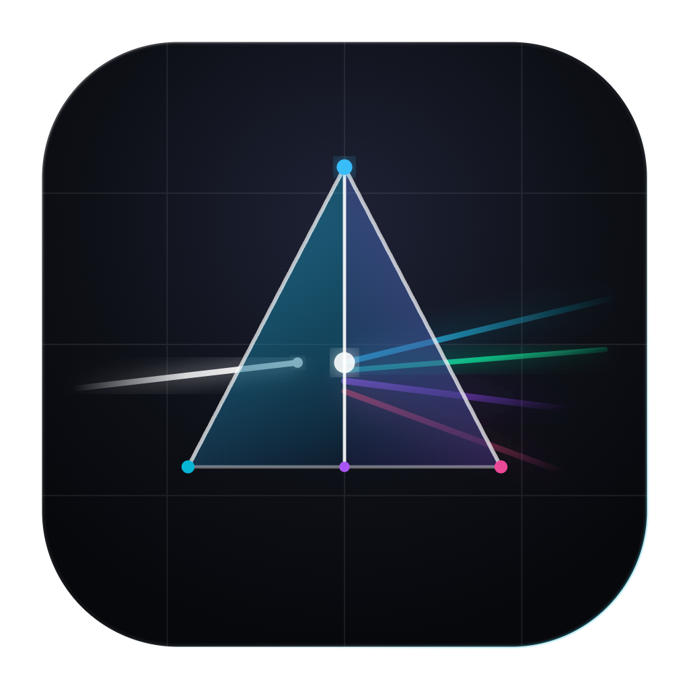

<p align="center">
  
</p>

<h1 align="center">Prism</h1>

<p align="center">
  <strong>One launcher for every Cursor you run.</strong><br />
  Isolated profiles — own settings, extensions, login, chat history — with live stats,<br />
  instant switching, and per-profile title bar colors so you never mix up Work and Personal again.
</p>

<p align="center">
  <a href="https://github.com/moderniselife/prism/actions/workflows/pr.yml"></a>
  
  
  
  
</p>

<p align="center">
  <a href="#features">Features</a> ·
  <a href="#quick-start">Quick start</a> ·
  <a href="#how-it-works">How it works</a> ·
  <a href="#layout">Layout</a> ·
  <a href="#faq">FAQ</a>
</p>

---

A Mojo Layers project. **Three native apps, one profile format:**

| Platform | Stack | Location | Launch |
|----------|-------|----------|--------|
| 🍎 macOS | SwiftUI | `Sources/` + `build.sh` | `./build.sh && open "build/Prism.app"` |
| 🪟 Windows | WPF / .NET 8 | [`windows/`](windows/) | `dotnet build windows/CursorProfiles.csproj -c Release` |
| 🐧 Linux | GTK4 + libadwaita (Python) | [`linux/`](linux/) | `python3 linux/prism.py` |

All three read and write the same `~/.cursor_profiles` directory and `.profiles.json` metadata, so profiles roam across operating systems. Every number the UI shows is **measured live** — resident memory from `ps`, window counts from the on-screen window list, CPU from the kernel. Nothing is hardcoded.

## Features

### 🗂️ Profiles, properly isolated
- **Profile grid** — colorful cards with per-profile emoji + accent color, disk size, and last-launched info
- **Your original Cursor profile is protected** — it shows up as a pinned **Main Cursor** card with a `BUILT-IN` badge, launches Cursor exactly like opening it normally (no `--user-data-dir`), can be **cloned** into a new managed profile, and can never be deleted
- **Create / edit / duplicate / rename** with per-profile launch defaults (memory limit, default project folder)
- Each profile is a separate `--user-data-dir`: own settings, extensions, login, chat history. Existing profiles are picked up automatically

### ⚡ Launching & switching
- **One-click launch** — double-click a card, or open the options popover for per-launch overrides (memory, project folder, force a new window)
- **Drag & drop** — drop any folder onto a card to open it with that profile
- **Global Quick Switch** — press **⌥Space from any app** for the Spotlight-style palette; `⌘K` focuses search, `⌘N` creates a profile
- **Menu bar dropdown** — live per-profile stats, Focus/Start, **Stop All**, and one-click hub access without opening the main window

### 📊 Honest live telemetry
- **Live resident memory** per running profile (summed RSS) against its configured `--max-memory` limit, plus real total RAM for your Mac
- **Real on-screen window counts** per profile — counted, never guessed
- **Real system CPU %** in the status bar
- **Running detection** with graceful quit (SIGTERM)

### 🎨 Tell profiles apart at a glance
- **Distinct title bar color per profile** — merged into each profile's `User/settings.json` (`workbench.colorCustomizations` + `window.titleBarStyle: "custom"`), visible in the window, Cmd+Tab, and Mission Control. Your own settings are preserved; only the title bar keys are touched
- **Pin, search, sort** (name / recently used / size)
- **Safe delete** — profiles go to the Trash, never `rm -rf`
- **Cursor auto-detection** via Launch Services + well-known paths, with a custom-path override in Settings
- **Light & dark mode** that follow the system

## Quick start

**macOS** — requires macOS 14+ and the Xcode Command Line Tools (no full Xcode):

```bash
./build.sh
open "build/Prism.app"
```

The build compiles the Swift sources, generates `Prism.icns` from [`assets/logo.png`](assets/logo.png), assembles and ad-hoc signs the bundle. Optionally move it to `/Applications`:

```bash
cp -R "build/Prism.app" /Applications/
```

**Windows** — requires the [.NET 8 SDK](https://dotnet.microsoft.com/download):

```powershell
dotnet build windows/CursorProfiles.csproj -c Release
```

See [`windows/README.md`](windows/README.md) — including how to pin per-profile taskbar shortcuts with their own icons.

**Linux** — requires GTK 4.10+, libadwaita 1.2+, and PyGObject (see [`linux/README.md`](linux/README.md) for distro packages):

```bash
python3 linux/prism.py
```

Every pull request to `main` rebuilds all three platforms automatically — see [`.github/workflows/pr.yml`](.github/workflows/pr.yml).

## How it works

```
~/.cursor_profiles/
  .profiles.json        # names, colors, emoji, launch defaults (shared across OSes)
  Work/                 # a full Cursor user-data-dir
  Personal/             # another one — fully independent
```

Launching a profile runs Cursor with `--user-data-dir <profile> --max-memory <limit>`, so isolation is enforced by Cursor itself rather than by anything Prism fakes. The built-in profile launches with no `--user-data-dir` at all — byte-for-byte identical to opening Cursor normally.

## Layout

```
Sources/CursorProfiles/
  CursorProfilesApp.swift   # App entry, hidden title bar, menu-bar extra, ⌥Space hotkey
  ContentView.swift         # Main hub: title bar, filters, grid, live status bar
  ProfileCard.swift         # Card UI, live memory bar, launch popover, drag & drop
  ProfileEditorSheet.swift  # Create/edit sheet with live preview
  SpotlightCommandBar.swift # ⌥Space quick-switch palette
  SettingsView.swift        # Cursor path, defaults, storage
  ProfileStore.swift        # Metadata, CRUD, live RSS/CPU/window polling
  SystemStats.swift         # Real CPU/RAM/window measurement + global hotkey helpers
  CursorLauncher.swift      # Find/launch/quit Cursor processes
  TitleBarColorizer.swift   # Merges per-profile title bar colors into User/settings.json
  PrismTheme.swift          # Adaptive light/dark design system
  MeshBackgroundView.swift  # Ambient background
  Models.swift              # Profile model, palette, formatting helpers
assets/
  logo.png                  # Source of truth for the logo + macOS app icon
```

## FAQ

<details>
<summary><strong>Why is there no "pin to Dock with a custom icon" feature?</strong></summary>

An earlier build generated a wrapper `.app` per profile with its own icon. It was removed for two reasons:

1. **It didn't work while running.** macOS shows the Dock icon of whatever bundle is *actually running* — since the wrapper just launches Cursor's real binary, open windows always showed Cursor's stock icon.
2. **It multiplied permission prompts.** Each wrapper is a distinct app identity, and macOS ties Microphone/Camera/folder consent to whichever bundle launched Cursor — so every wrapper re-triggered Cursor's entire permission set as a brand-new app.

Title bar coloring replaces it: it only edits a JSON settings file — no new app identity, no signing, no permission implications. (Windows instead offers per-profile taskbar shortcuts, which are just `.lnk` pointers to the same `Cursor.exe`, so they dodge the identity problem.)

</details>

<details>
<summary><strong>Does Prism spy on my code or phone home?</strong></summary>

No. Everything is local: it reads `ps` output, the on-screen window list, and files under `~/.cursor_profiles`. There is no network code, no analytics, no daemon.

</details>

<details>
<summary><strong>CPU shows "—" sometimes?</strong></summary>

System CPU % is computed from kernel deltas, which need two samples — the first poll after launch has nothing to diff against, so it shows a dash until the second one lands (~15s).

</details>
